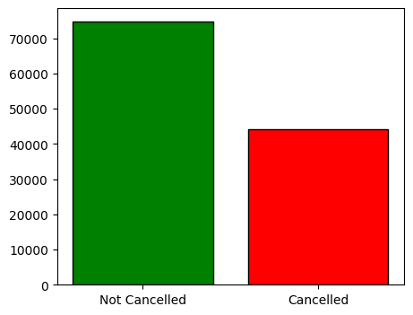
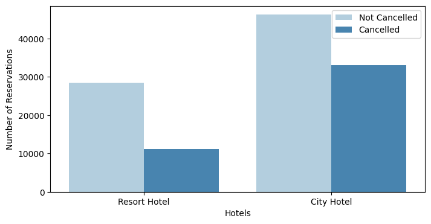
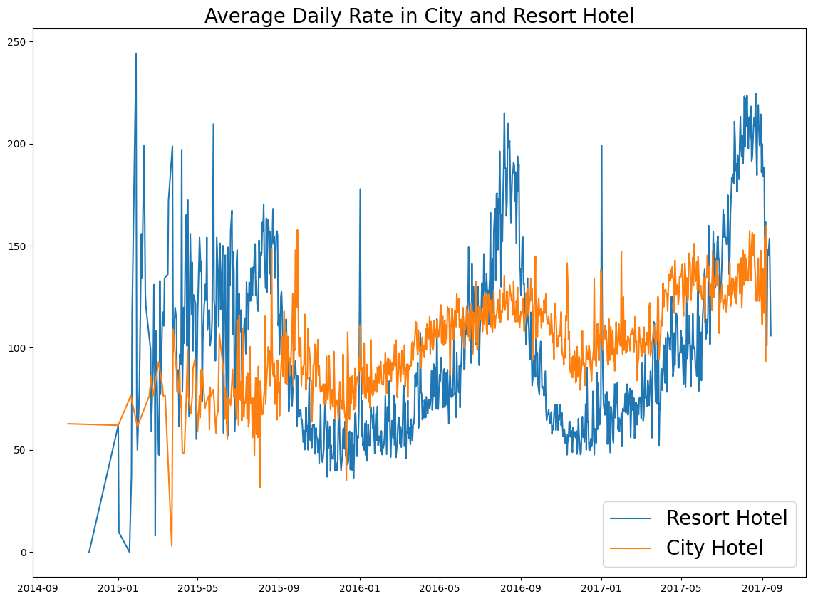
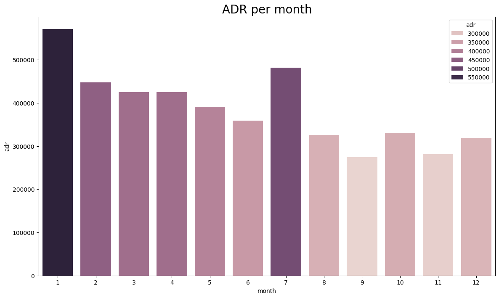

# Business Problem

In recent years, `City Hotel` and `Resort Hotel` have experienced high cancellation rates, leading to various challenges, including reduced revenues and suboptimal room occupancy. Lowering cancellation rates has become the primary objective for both hotels to improve their revenue generation and overall efficiency.

This report focuses on analyzing hotel booking cancellations and other unneccessary factors impacting business performance and yearly revenue, providing thorough business advice to address these issues.

## Assumptions

1. No unusuall Occurences between 2015 and 2017 will have a substantial impact on the data used
2. The information is still current and can be used to analyze a hotel's possible plans in an efficient manner
3. There are no unanticipated negatives to the hotel employing any adviced technique
4. The hotels are not using any of the suggested solutions
5. The biggest factor affecting the effectiveness of earning income is booking cancellations
6. Cancellations result in vacant rooms for the booked length of time
7. Clients make hotel reservations the same year they make cancellations.

## Research Question

1. What are the variables that affect hotel reservation cancellations ?
2. How can we make hotel reservations cancellations better ?
3. How will hotels be assisted in making pricing and promotional decisions

## Hypothesis

1. More cancellations occur when prices are higher
2. When there is a longer waiting list for room allotment, customers tend to cancel more frequently
3. The majority of client are coming from offline travel agents to make their reservations

## Analysis

During the Exploratory Data Analysis of the Dataset, the following finding were observed: 

### Cancel ratio by hotel
- It is observed that the City and Resort Hotel's total reservations are `62.86% Not Cancelled` but `37.13% Cancelled` when analyzed all time.
- Through the bar graph below, it can be clearly seen that Cancelled reservations are considerably much higher than normal.

    

- Furthermore, When we look deeper into restaurant wise canceling ratio, it becomes more visible.
- As the graph below clearly indicates the insights of Cancelled and not Cancelled Reservation of both City and Resort Hotel

    

### ADR analysis by hotel
- In this section, After gathering insights about ADR (Average Daily Rate) In Both the hotels, It can be observed that ADR is greated in Resort Hotel when compared to City Hotel
- The graph below gives insights about the ADR comparison between Resort and City Hotel

    

### Reservation status by Month
- By further gaining insight about Reservation status, both cancelled and not cancelled, by month, Our hypothesis is observed to be closer than Actual situation.
- The graph below gives an elaborated Insight about the Reservation Status comparison on a monthly parameter
- After further Analyzing the graph, It can be observed that the hotel experiences `fewer cancellations in August and September`.
- whereas, the hotels experience `Large cancellations in January`.

    

- From the graph below, this statement appears to be more precise as `in January, the Hotels experience most cancellations` and `In September, They experience fewest cancellations`

    

### TOP-10 countries with max cancellations
- Now, that we know about the months of most cancellations, we can dive deeper into regions where most cancellations are done.

- This pie charts concludes that `cancellations are majorly from PORTUGAL` country.
On the basis of this hypothesis, Here are some suggestions for the Hotel facilitator:
  - Hotels in Portugal should be equipped with latest and better facilities to curate customers.
  - Promotional discounts must be held to inrease customer reach.

    

### Customers medium of reach
- It is important to know the mediums which are adopted by the customers to book their reservations as they play a major role in analyzing the root cause of the problem.
- The graph below precisely visualized this information by conluding that `most of the customers book do their reservations via Online Travel Agents`

    

### ADR resultings
- All of our above analysis throw limelight on the supporting causes of the problem that conlcude that there might be a parameter that is causing a surge in cancellation every once in a while.
- On further deeply analyzing the data, it is observed that whenever there is a surge in Average Daily Rate of rooms of the hotel, the cancellation rates get spiked.
- This also contrast the fact that People prefer Hotels that fit in their budget, and if they find better prices than their current reserved accomodities, they tend to shift from one vendor to another.
- The below graph show the detailed intel by depicting that cancellations seem to surge when ADR is high.
- Keep in mind the below graph depicts the information between 2016 to 2017.
  
    

## Recommendations:
- Targeted Promotions: Implement targeted promotional campaigns during months with historically high cancellations (e.g., January) to attract and retain customers.

- Regional Improvements: Focus on improving facilities and offering special discounts in Portugal to address the high cancellation rates in that region.

- Pricing Strategies: Adjust pricing strategies to remain competitive. Consider implementing flexible pricing or offering discounts to reduce cancellation rates.

- Channel Optimization: Strengthen partnerships with OTAs and explore opportunities to enhance customer engagement through these channels.

- Monitor and Adapt: Continuously monitor cancellation trends and adjust strategies as needed to adapt to changing patterns and improve overall hotel performance.